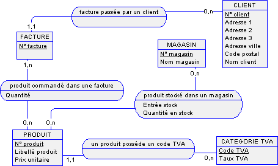

# Test SQL  
## se referer à la base de donnée db_cinema.sql

- Requête qui liste les enregistrements de tous les informations de la liste des films
- Requêtes qui affiche le nombre d’abonnés
- Requête qui liste les prénoms des réalisateurs par ordre alphabétique
- Requête qui affiche le nom, prénom du real, le nom prénom de l’acteur principal et le titre du film de chaque film
- Requête qui affiche la moyenne de tous les films
- Requête qui affiche le nombre de film Avengers
- Requête qui affiche les enregistrements des acteurs dont le nom commence par la lettre r
- Requête qui affiche le nom et prénom des abonnées qui ont vu aucun film
- Requête qui affiche les films qui ont la meilleure note
- Requête qui donne le film qui a la moins bonne note
- Requêtes qui affichent les films qui ont une plus grande note que la moyenne des notes films
- Requête qui pour chaque acteur nous donne le nombre de film où il a joué
- Le nom et prénom et le nombre de film de l’acteur qui a joué dans le plus de film
- Le nom et prénom et le nombre de film de l’abonné qui a vu le plus de film
- Le nom et prénom du réalisateur qui a réalisé le plus de film
- Créer un trigger, une procédure et un évent de votre choix.  

## Création d'un MLD avec workbench depuis l'image suivante  

## Divers  

- La base de donnée qui sera utilisé pour les différentes requêtes se trouve dans le dossier db  
- Les différentes requêtes sont écrite dans scriptSQL.sql  
- Le MLD est crée dans le fichier Magasin.mwb  
